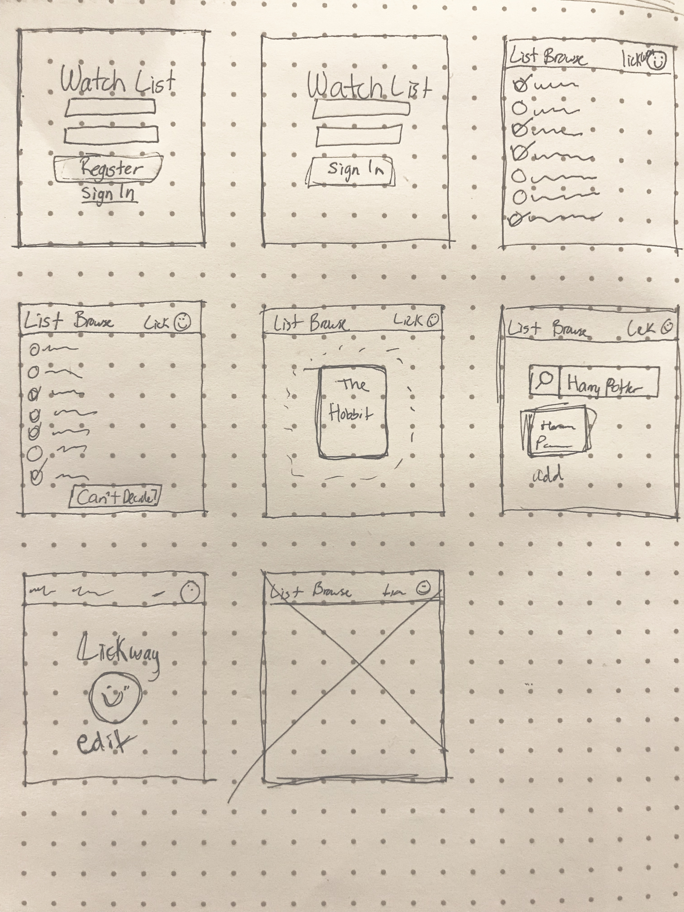
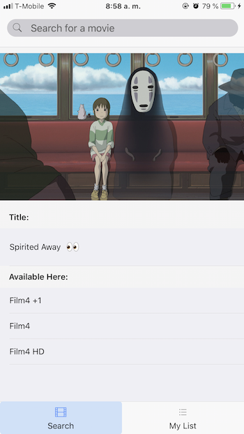
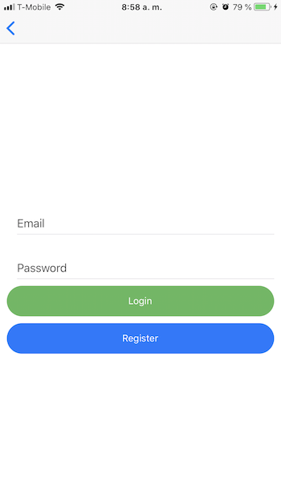
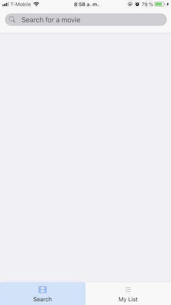
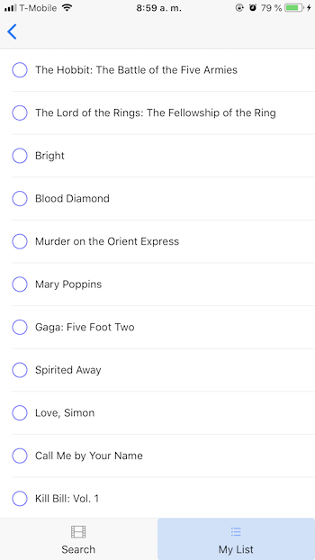

# WatchList
 - A React Native app that shows where to find movies online and add movies to a Watch List.

# Wireframes


# MVP User Stories
- As a movie lover, I want the ability to add movies to my own list as a reminder of what to watch in the future.
- As a visual person, I want to see the movie cover.
- As an organized person, I want to know which movies I have already watched.
- As a partner, I want to specify if the movie is just on my list or both of us.
- As someone with not all of the facts, I want the ability to search for a movie even if I don't know the whole title.

# MVP 1.1 User Stories
- As a private person, I want the ability to create an account with a password so no one can hack my account.
- As someone indecisive, I want a feature that chooses a move from my list at random as a suggestion to watch.

# Post MVP User Stories
- As someone with a trigger happy finger, I want my click to not register if I swipe away.
- As someone with a large list of movies to watch, I want the ability to infinitely scroll to see my list.

# Screenshots






# Technologies
- [React Native:](https://facebook.github.io/react-native/docs/getting-started.html)
  - React Native lets you build mobile apps using only JavaScript. It uses the same design as React, letting you compose a rich mobile UI from      declarative components.
  - To install the command line interface:
  ```
  $ npm install -g react-native-cli
  ```
  - To create a React Native project:
  ```
  $ react-native init NameOfProject
  ```
- [Utelly API](https://market.mashape.com/utelly/utelly)
- [Axios:](https://github.com/axios/axios)
  - Promise based HTTP client for the browser and node.js
  ```
  $ yarn add axios
  ```
- [Firebase:](https://firebase.google.com/?gclid=EAIaIQobChMI-tC9y9jz2gIVAhgMCh1DLgnMEAAYASAAEgItZPD_BwE)
  - Backend service created by Google for mobile applications. Handles databases and user authentication.

- [NativeBase.io:](http://docs.nativebase.io/)
  - A UI component library made specifically for React Native.
  ```
  $ yarn add native-base
  ```

- [React Navigation:](https://reactnavigation.org/)
  - Routing and navigation library for React Native apps.
  ```
  $ yarn add react-navigation
  ```
# Video
 - [Demo](https://youtu.be/NIHWHRp3DWg)

# WatchList post MVP
- Once the user is logged in, keep them logged in even once they exit the app.
- Allow the user to delete any movie they may have added to their Watch List.
- Implement fingerprint login.
- Fix the checkbox feature. Currently, once one gets checked, all get checked.
- Add a random movie generator that shuffles unchecked movies as an option for the user to watch.
- Add a button to search bar that allows full deletion of the search.
- Hide keyboard when user taps on the screen.
- Add a profile page with logout, and other profile settings.
- Fix the image size when a movie is searched
